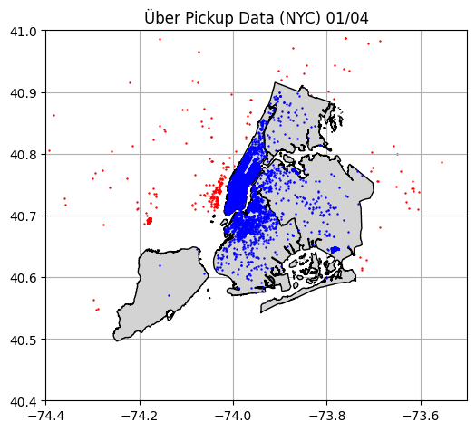

# Corridas Über & Clima em NYC (Abril/2014)

Este projeto realiza um **pipeline completo de ETL + análise exploratória (EDA)** usando dados de corridas da Uber em Nova York durante **abril de 2014**, integrando **dados geoespaciais** (SHP / GeoJSON) e **dados climáticos** para permitir análises temporais e espaciais mais ricas.

O foco principal é:

* Limpar e enriquecer dados brutos de corridas Uber usando **GeoPandas**
* Associar cada corrida a um **distrito (borough)** de NYC
* Gerar **datasets finais em CSV** prontos para análise estatística e séries temporais

---

## 🗺️ Visão Geral do Pipeline

O fluxo do projeto segue o diagrama apresentado:

* **Entradas**:

  * `nyc_uber_raw.csv` — dados brutos de corridas Uber (data/hora, latitude, longitude, base)
  * `nyc_border.shp` — fronteira oficial da cidade de Nova York
  * `nyc_boroughs.geojson` — bairros e distritos de NYC
  * Open-Meteo API — dados climáticos horários

* **Processamento**:

  * ETL geoespacial com **GeoPandas**
  * ETL climático com **Requests + Pandas**

* **Saídas**:

  * `nyc_uber_boroughs.csv` — corridas Uber limpas e associadas a distritos
  * `nyc_uber_weather.csv` — séries temporais climáticas

* **Análises**:

  * EDA estatística
  * Análise temporal de corridas

---

## 📦 Dados Utilizados

### 🚕 Uber Pickups

* Período: **Abril de 2014**
* Resolução temporal: **horas e minutos**
* Campos principais:

  * `date/time` (datetime)
  * `lat`, `lon`
  * `base` (5 bases de veículos Uber)

### 🗺️ Dados Geoespaciais

* `nyc_border.shp`: usado para definir o limite oficial da cidade
* `nyc_boroughs.geojson`: contém múltiplos bairros, posteriormente agregados

### 🌦️ Clima

* Fonte: **Open-Meteo API**
* Variáveis típicas:

  * Temperatura
  * Precipitação
* Resolução: **horária**

---

## 🧹 ETL Geoespacial (GeoPandas)

### 1️⃣ Conversão para GeoDataFrame

Os dados brutos da Uber são convertidos em um `GeoDataFrame` usando coordenadas (`lat`, `lon`) no CRS **EPSG:4326**.

### 2️⃣ Remoção de corridas fora de NYC

* É realizado um **Spatial Join** entre:

  * `nyc_uber_raw` (pontos)
  * `nyc_border` (polígono da cidade)
* Corridas fora da fronteira oficial são descartadas
* Aproximadamente **2,35%** do dataset original é removido

<p align="center">
 
</p>

### 3️⃣ Associação aos distritos (boroughs)

* O arquivo `nyc_boroughs.geojson` contém vários bairros menores
* É aplicado um `.dissolve(by="borough")` para formar os **5 distritos oficiais**:

  * Manhattan
  * Brooklyn
  * Queens
  * Bronx
  * Staten Island
* Um novo **Spatial Join** associa cada corrida a um distrito
* Uma nova coluna `borough` é adicionada ao dataset

<p align="center">
   
</p>

### 4️⃣ Exportação final

* Colunas geoespaciais (`geometry`) e intermediárias são removidas
* Dataset final salvo como:

```
nyc_uber_boroughs.csv
```

---

## 🌦️ ETL Climático

* Dados climáticos são coletados via **Open-Meteo API**
* Processamento feito com **Requests + Pandas**
* Os dados são organizados por:

  * Data
  * Hora
* Resultado salvo como:

```
nyc_uber_weather.csv
```

Esse arquivo é compatível com análises de **séries temporais** e pode ser facilmente combinado com agregações horárias das corridas Uber.

---

## 📊 Análise Exploratória (EDA)

A partir de `nyc_uber_boroughs.csv`, são realizadas diversas análises:

### 🔢 Contagens

* Número total de corridas:

  * Por **borough**
  * Por **base**
  * Por **dia** ao longo do mês
* Contagens combinadas:

  * `borough + base`

### 📅 Análises Temporais

* Contagem de corridas:

  * Por dia
  * Por intervalos de tempo (horas)
* Identificação de padrões diários e semanais

### 📈 Estatísticas Agregadas

* **Média diária de corridas**:

  * Por distrito
  * Por base de veículo
* Cálculo de métricas como média e desvio padrão

### Conclusões

* A contagem de corridas diárias oscila bastante pelo mês entre 10 e 30 mil corridas, aumentando bastante perto do fim do mês de Abril.
* A base TLC de veículos `B02682` concentra a maior quantidade de corridas por quase todo o mês, sendo superada pela base `B02529` apenas próximo do fim do mês.
* O distrito que mais concentra corridas é Manhattan (média diária perto de 15 mil corridas), o que também é visível pelo gráfico de mapeamento da cidade com as corridas espalhadas, seguido por Brooklyn (média perto de 2 mil corridas) e então Queens (média próxima de mil corridas).
* Portanto, em questão de lucro e investimentos da empresa Über com relação às análises, a melhor solução é focar nas corridas feitas nas regiões de Manhattan e Brooklyn, assim como fortificar a parceira com as bases de veículos `B02682` e `B02529`.

---

## 📉 Séries Temporais

Os dados de corridas agregados no tempo podem ser combinados com `nyc_uber_weather.csv` para:

* Avaliar correlações entre:

  * Volume de corridas
  * Temperatura
  * Precipitação

### Conclusões:

* Foi feito uso de modelo estatísico SARIMAX (Seasonal AutoRegressive Integrated Moving Average with eXogenous regressors) para correlacionar temperatura e precipitação com volume de corridas.
* Por uma correlação de Pearson viu-se que a correlação do volume de corridas com a temperatura é positiva (aumento desta aumenta as corridas) e com a precipitação é negativa (aumento desta diminuiu as corridas).
* Foi obtido um z-score de -0.216 para temperatura (perto de zero, efeito não significativo) e de -2.506 para precipitação (longe de zero, significante).
* O p-value de 0.012 (1.2%) da precipitação indica que há pouca chance de seu efeito ser devido a outros fatores.
* Por fim, o coeficiente -40.75 da precipitação indica que quando ela ocorre há decréscimo aproximado de 41 corridas/h fora do padrão usual das corridas. O clima então realmente afeta as corridas no geral.

---

## 🛠️ Tecnologias Utilizadas

* **Python**
* **Pandas**
* **GeoPandas**
* **Shapely**
* **Matplotlib / Seaborn**
* **Requests**
* **Jupyter Notebook (.ipynb)**

---

## 📁 Estrutura de Arquivos (simplificada)

```
├── data/
│   ├── nyc_uber_raw.csv
│   ├── nyc_uber_boroughs.csv
│   ├── nyc_uber_weather.csv
│   ├── nyc_border.shp
│   └── nyc_boroughs.geojson
├── Uber_NYC_Weather.ipynb
├── README.md
```

---

## ✅ Resultados

O projeto entrega um **dataset limpo, enriquecido e pronto para análise**, conectando informações espaciais, temporais e climáticas. Ele serve como base sólida para:

* Análises urbanas
* Estudos de mobilidade
* Modelagem estatística
* Séries temporais

---

📌 *Projeto focado em ETL geoespacial e análise exploratória aplicada a dados reais de mobilidade urbana e clima.*
